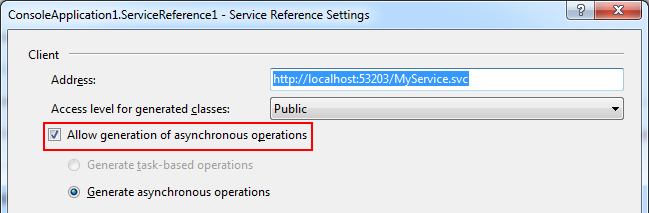

# What is this? #

Since [Microsoft.Bcl.Async](http://nuget.org/packages/Microsoft.Bcl.Async/) it is possible to use the keywords async and await for easier multithreaded development in .NET 4.

Unfortunately the tool to generate WCF client code creates methods which can be used with await only for the target framework version 4.5. This tool loads the assembly containing the interface description and generates a code file that wraps existing multithreaded WCF methods into async-consumable methods.

Suppose you have this interface (the attributes are removed for simplicity):

    public interface IMyService
    {	
        int Add(int a, int b);
        System.IAsyncResult BeginAdd(int a, int b, System.AsyncCallback callback, object asyncState);	
        int EndAdd(System.IAsyncResult result);
    }

WcfTaskGen will generate this Extension method:

    public System.Threading.Tasks.Task<int> AddTaskAsync(this IMyService instance, int a, int b)
    {
        return System.Threading.Tasks.Task.Factory.FromAsync<System.Int32, System.Int32, System.Int32>(instance.BeginAdd, instance.EndAdd, a, b, null);
    }

# Requirements? #

In order to create the additional methods your current WCF client interface must be built and include the asynchronous operations:

This setting creates the BeginAdd and EndAdd methods in the example interface.

# Quick-Start #

Suppose you have the assembly Client.dll which contains the interface IMyService in the namespace Client.ServiceReference.
1. Extract the ZIP file from the download section into the same directory as Client.dll.
2. Open a command prompt in the Directory
3. Enter: `WcfTaskGen -a Client.dll -o MyServiceExtensions.cs -i Client.ServiceReference.IMyService`
4. Press Enter and you will find the file MyServiceExtensions.cs in the directory.

Add the file MyServiceExtension.cs to your Visual Studio solution and you can use the function AddTaskAsync on any object that implements IMyService.

The method names and parameters are same which Visual Studio would create for task-based operations in .NET 4.5 so that you don't need to change your code when you upgrade your project to .NET 4.5 and want to use the task-based operations generated from Visual Studio.

# Parameters #

The following parameters are required:  
-a (or --assembly): _Specifies the path of the assembly containing the interface._  
-o (or --output): _Specifies the path of the generated code file._  
-i (or --interface): _The name of the WCF client interface (including the namespace)._  

Additionally these parameters can be used:  
-l (or --language): _Specifies the generated language. Must be C# or VB._  
-t (or --type): _Specifies the type of the generated code. Either creates a class with extension methods (default) or creates a new interface which inherits the original interface and adds the new methods to the generated Client._  
--indentation: _Sets the number of spaces which are used for indentation. The default is 4._